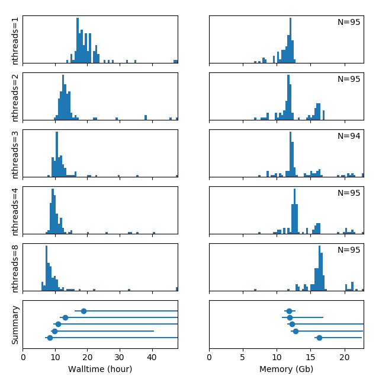

Utilities for using `fmriprep <https://fmriprep.org>`__ on the compute cluster at the `Donders Institute <https://www.ru.nl/donders/>`__ of the `Radboud University <https://www.ru.nl/english/>`__.

Running fmriprep on the HPC cluster:
====================================

The ``fmriprep_sub.py`` utility is a wrapper around fmriprep that queries the `BIDS <http://bids.neuroimaging.io>`__ directory for new participants and then runs them (as single-participant fmriprep jobs) on the compute cluster. For more info run: :code:`$ fmriprep_sub.py -h`

Example:
--------

.. code-block:: console

   $ fmriprep_sub.py /project/3017065.01/bids --nthreads 3 --mem_mb 28000
   >>> Submitting job (1/95):
   qsub -l nodes=1:ppn=3,walltime=48:00:00,mem=28000mb,file=50gb -N fmriprep_sub-P004  <<EOF
                            cd /home/mrphys/marzwi
                            unset PYTHONPATH; export PYTHONNOUSERSITE=1; singularity run --cleanenv /opt/fmriprep/20.2.1/fmriprep-20.2.1.simg /project/3017065.01/bids /project/3017065.01/bids/derivatives participant -w \$TMPDIR --participant-label P004 --skip-bids-validation --fs-license-file /opt_host/fmriprep/license.txt --mem_mb 28000 --omp-nthreads 3 --nthreads 3
   EOF
   >>> Skipping already running / scheduled job (2/95): fmriprep_sub-P001
   >>> Nothing to do for job (3/95): /project/3017065.01/bids/sub-P003 (--> /project/3017065.01/bids/derivatives/fmriprep/sub-P003.html)
   >>> Submitting job (4/95):
   qsub -l nodes=1:ppn=3,walltime=48:00:00,mem=28000mb,file=50gb -N fmriprep_sub-P002  <<EOF
                            cd /home/mrphys/marzwi
                            unset PYTHONPATH; export PYTHONNOUSERSITE=1; singularity run --cleanenv /opt/fmriprep/20.2.1/fmriprep-20.2.1.simg /project/3017065.01/bids /project/3017065.01/bids/derivatives participant -w \$TMPDIR --participant-label P002 --skip-bids-validation --fs-license-file /opt_host/fmriprep/license.txt --mem_mb 28000 --omp-nthreads 3 --nthreads 3
   EOF
   >>> Submitting job (5/95):
   [..]
   >>> Submitting job (95/95):
   qsub -l nodes=1:ppn=3,walltime=48:00:00,mem=28000mb,file=50gb -N fmriprep_sub-P295  <<EOF
                            cd /home/mrphys/marzwi
                            unset PYTHONPATH; export PYTHONNOUSERSITE=1; singularity run --cleanenv /opt/fmriprep/20.2.1/fmriprep-20.2.1.simg /project/3017065.01/bids /project/3017065.01/bids/derivatives participant -w \$TMPDIR --participant-label P295 --skip-bids-validation --fs-license-file /opt_host/fmriprep/license.txt --mem_mb 28000 --omp-nthreads 3 --nthreads 3
   EOF

   ----------------
   Done! Now wait for the jobs to finish... Check that e.g. with this command:

     qstat -a $(qselect -s RQ) | grep fmriprep_sub

   For more details, see:

     fmriprep -h

HPC resource usage
==================

The ``hpc_resource_usage.py`` utility plots walltime and memory usage of PBS jobs submitted to the compute cluster. For more info run: :code:`$ hpc_resource_usage.py -h`

Example:
--------

The PBS logfiles of the ``fmriprep_sub.py`` command as shown above with 1, 2, 3, 4 and 8 compute threads & CPU cores were saved in separate directories. This multi-threading benchmark dataset is loaded as example data when running the ``demo``:

.. code-block:: console

   $ hpc_resource_usage.py demo
   Reading logfiles from: "/opt/fmriprep/dccn/nthreads=1"
   Reading logfiles from: "/opt/fmriprep/dccn/nthreads=2"
   Reading logfiles from: "/opt/fmriprep/dccn/nthreads=3"
   Reading logfiles from: "/opt/fmriprep/dccn/nthreads=4"
   Reading logfiles from: "/opt/fmriprep/dccn/nthreads=8"

Conclusions on fmriprep v20.2.1 multi-threading:
 - The memory usage is largely independent of the number of compute threads
 - The speed increase is not very significant when increasing the number of compute threads above 4
 - The majority of jobs have a comparable walltime, but some jobs take much longer. NB: the spread of the walltimes is increased by the heterogeneity of the DCCN compute cluster and occasional inconsistencies (repeats) in the data acquisition in certain (heavily moving) participants
 - As shown by the peak in the walltime histogram below 2h, a significant fraction of the jobs failed when the number of compute threads was set to 8. The full trace of the error message (``could not run node: fmriprep_wf.single_subject_P001_wf.anat_preproc_wf.fs_isrunning``) can be seen e.g. in ``./nthreads=8/fmriprep_sub-P001.o40897230``
